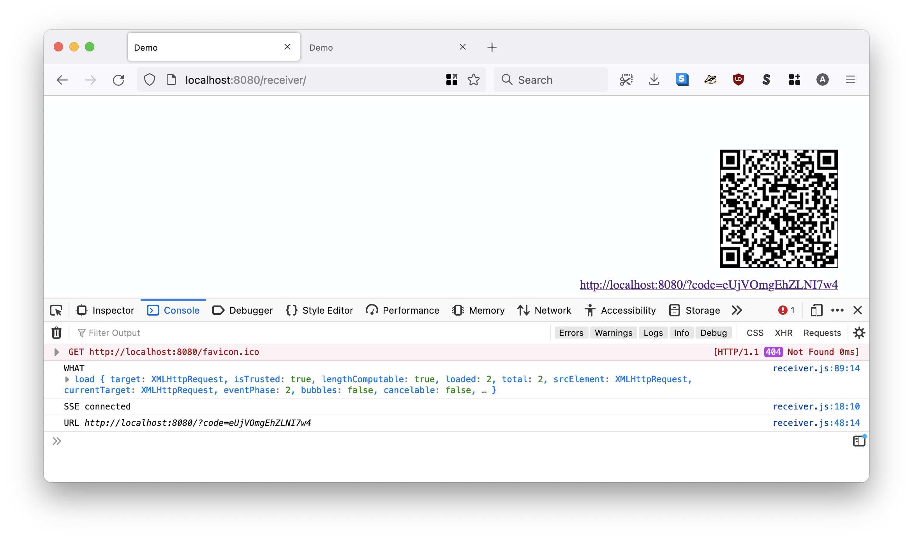
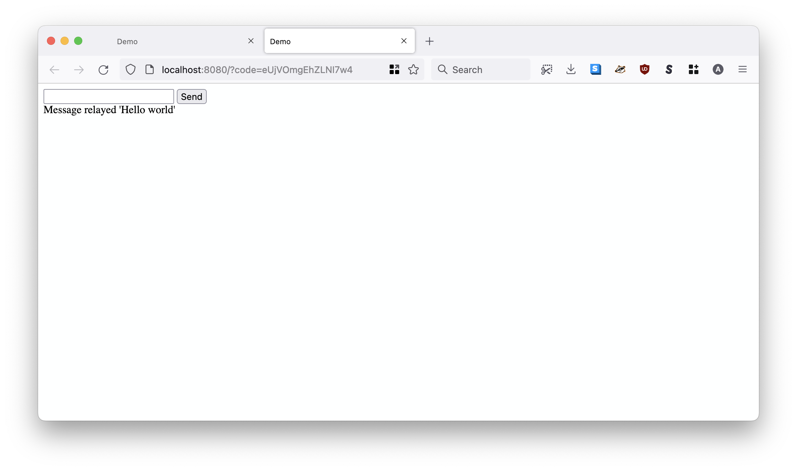
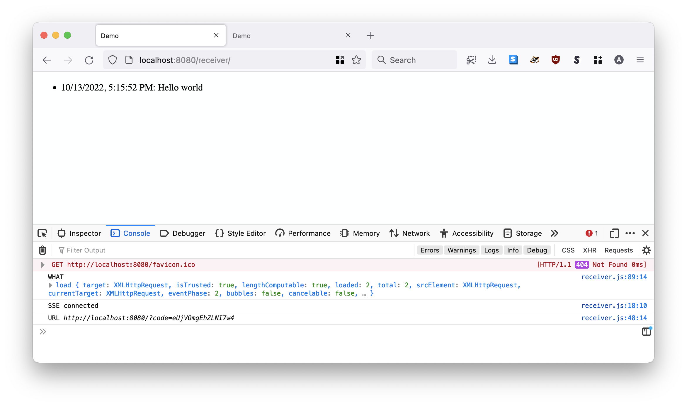
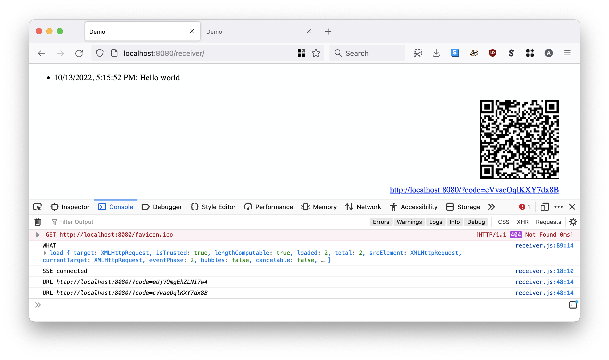
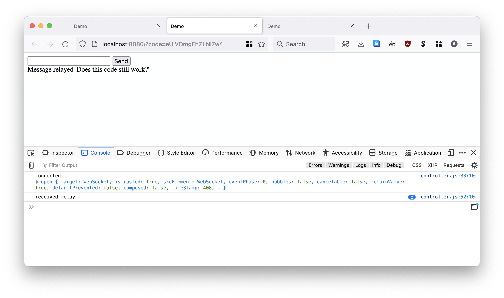
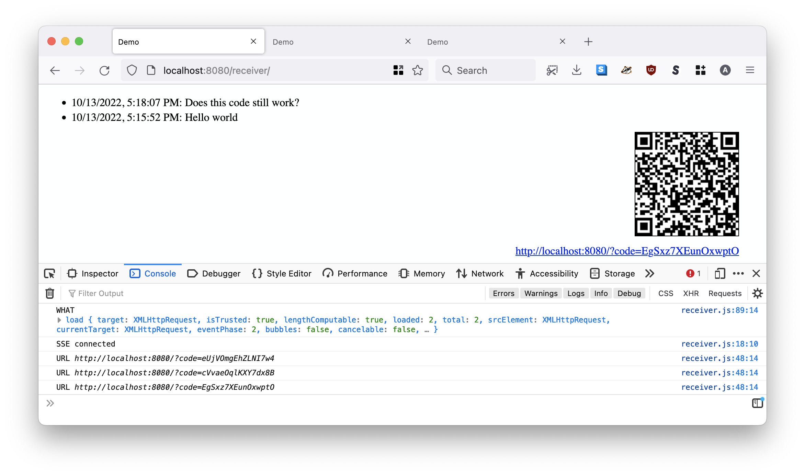
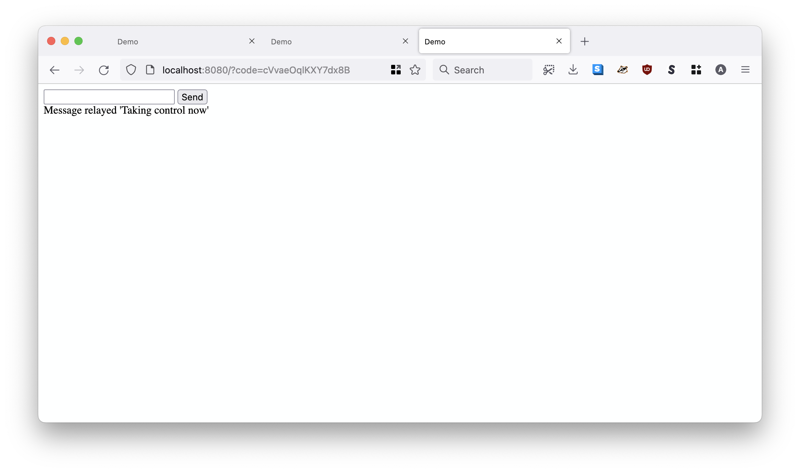
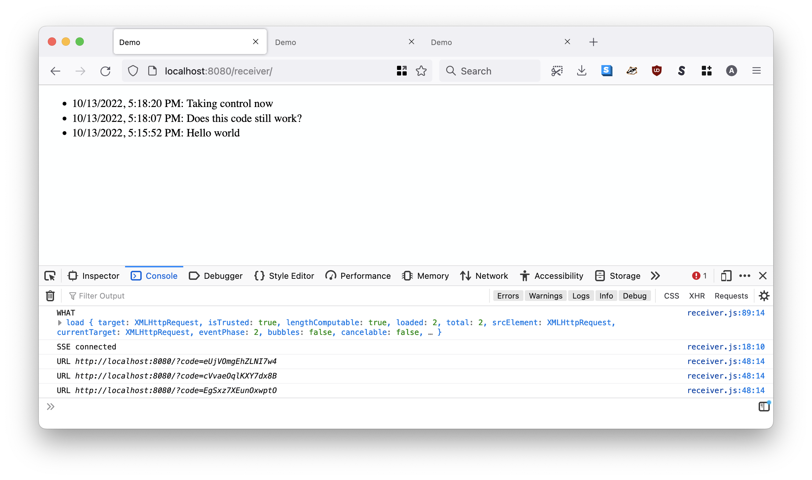
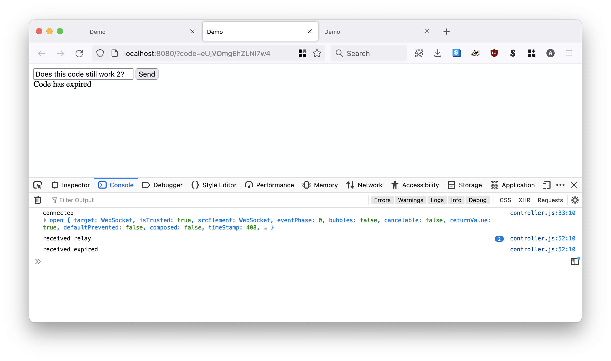

# www-multiscreen-starter

`www-multiscreen-starter` is an example HTTP "relay" server. It listens for events on a [WebSocket](https://developer.mozilla.org/en-US/docs/Web/API/WebSocket) connection and then relays (parrots) them back over a separate [Server-Sent Events](https://developer.mozilla.org/en-US/docs/Web/API/Server-sent_events) connection.

It was developed to work in tandem with the [ios-multiscreen-starter](https://github.com/sfomuseum/ios-multiscreen-starter) iOS application when configured to run in "hands-free" mode.

These applications were written as "reference implementations" to demonstrate the underlying functionality of [the interactive map installation in SkyTerrace Observation Deck](https://millsfield.sfomuseum.org/blog/2021/11/19/skyterrace/) at the San Francisco International Museum. Importantly these applications do not demonstrate how to build an interactive map but, rather, how to relay simple messages between an individual's mobile device and an iOS application using the `www-multiscreen-starter` application as a message broker.

Questions and bug reports should be filed as [new issues in this repository](https://github.com/sfomuseum/www-multiscreen-starter/issues).

For background, see:

* [Presenting the SkyTerrace Interactive Map at NACIS 2022](https://millsfield.sfomuseum.org/blog/2022/10/28/nacis/) (slides and notes from [NACIS 2022](https://nacis.org/annual-meeting/) conference)

* [Interactive Maps of SFO from 1930 to 2021 (and Beyond) at the T2 SkyTerrace](https://www.youtube.com/watch?v=hZ2NXeul0Qs&list=PLcBEhOBZvhcbTn1RC0zWbnuHA81SgIg8b&index=36) (video presented at the [NACIS 2022](https://nacis.org/annual-meeting/) conference)

* [iOS Multi-screen Starter Kit ](https://millsfield.sfomuseum.org/blog/2020/11/18/multiscreen/) (blog post on the [Mills Field website](https://millsfield.sfomuseum.org/blog))

* [the elephant in the room: build it or buy it?](https://www.aaronland.info/weblog/2020/11/12/touching/#mcn2020) (slides and notes from [Museum Computer Network 2020](https://mcn.edu/conferences/mcn-2020-virtual/) conference)

## Documentation

[](https://pkg.go.dev/github.com/sfomuseum/www-multiscreen-starter)

## Tools

Tools in this package have been written in the [Go programming language](https://go.dev) such that they can be compiled to run on Unix, MacOS and Windows systems. For example:

```
$> make cli
go build -mod vendor -o bin/server cmd/server/main.go
```

### server

`server` is an HTTP "relay" server. It listens for events on a WebSocket connection and then relays (parrots) them back over a separate Server-Sent Events connection.

```
$> ./bin/server -h
  -access-code-ttl int
    	The time-to-live in number of seconds for access codes. (default 300)
  -database-uri string
    	A valid gocloud.dev/docstore URI. (default "mem://access/Code")
  -enable-receiver
    	Enable a /receiver endpoint on the web server. Used for debugging.
  -host string
    	The host name to listen for requests on. (default "localhost")
  -port int
    	The port number to listen for requests on. (default 8080)
  -publisher-uri string
    	A valid sfomuseum/go-pubsub/publisher URI. (default "mem://pubssed")
  -sse-handler-ttl int
    	The number of seconds to allow SSE connections to stay open. (default 1200)
  -subscriber-uri string
    	A valid sfomuseum/go-pububs/subscriber URI. (default "mem://pubssed")
```

#### -database-uri

The `-database-uri` flag is expected to be a valid [GoCloud Docstore](https://gocloud.dev/howto/docstore/) URI. The `GoCloud` package is an abstraction library that provides a common interface for different implementations of the same underlying functionatlity, for example a "document store". This document store is used to store and validate access codes.

The default database configuration is an ephermeral in-memory database which should be sufficient for testing. Support for both local and remote instances of Amazon's [DynamoDB](https://gocloud.dev/howto/docstore/#dynamodb) is also available. If you need or want to support other document stores you will need to clone the [cmd/server/main.go](cmd/server/main.go) program and add the relevant `import` statements.

#### -publisher-uri and -subscriber-uri

The `-publisher-uri` and `-subscriber-flags` are expected to valid [sfomuseum/go-pubsub](https://github.com/sfomuseum/go-pubsub/) URIs. There are many pubsub (publish and subscribe) packages and this is the one SFO Museum wrote. It provides common interfaces to wrap the [GoCloud](https://gocloud.dev/howto/pubsub/) and [Redis](https://pkg.go.dev/github.com/go-redis/redis/v8#example-PubSub) pubsub implementations. As with the `-database-uri` the defaut "in-memory" pubsub implementation is sufficient for testing.

#### Example

```
$> go run -mod vendor cmd/server/main.go \
	-enable-receiver \
	-access-code-ttl 60
	
2022/10/13 17:01:22 Listening on localhost:8080
```

Importantly, in this example we are enabling the "receiver" endpoint. Normally this would be disabled in production but it useful for debugging events. The "receiver" endpoint is an example of a web application that might be running inside the `ios-multiscreen-starter` application. Once loaded in a web browser it connects to the (`www-multiscreen-server`) server and establishes a Server-Sent Event (SSE) connection. It then displays a QR code containing an access code generated by the server (and sent over the SSE connection).

First visit `http://localhost:8080/receiver` in your web browser. You should see something like this.



Remember the "receiver" page is only for debugging things in a web browser. That's why there's a URL under the QR code. If you click the link it will open the "controller" in another tab.

If your mobile device and the `server` application are running on the same wireless network you can start the server with the `-host {IP_ADDRESS_OF_THE_SERVER_APPLICATION}` and scan the QR code with your device's camera.

The "controller" page shows a simple form in which you type messages and hit send. For example, in this screenshot the message "Message world" has been sent:



If you switch back to the "recevier" page you should see that message:



After 60 seconds a new QR code (and link) will appear:



Because the code hasn't been claimed yet the "receiver" page will still be able to send messages. For example, sending the message "Does this code still work?":



And it does:



Now open the link with the _new_ code in a different tab and send the message "Taking control now":



There's the new message on the "receiver" page:



Switch back to the _first_ receiver page and try to type a new message. It will not be delivered because a newer code has been claimed:



## See also

* https://github.com/sfomuseum/ios-multiscreen-starter
* https://github.com/sfomuseum/go-pubsub
* https://gocloud.dev